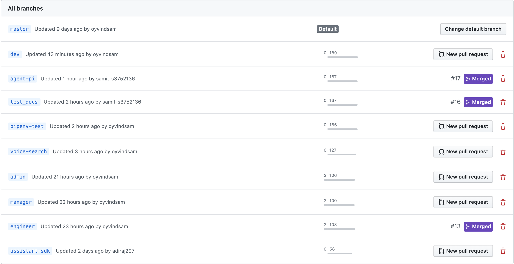

# Assignment 2 & 3 for Programming of Internet of Things (COSC2755)
### Members:
####   Samit Sharma (s3752136)
####   Aditya Raj (s3730562)
####   Oyvind Samuelsen (s3801950)
####   Sagar Chandrakant Pardikar (s3715199)
<p>&nbsp;</p>

## Documentation
See docs/html/index.html
To generate html docs, run ```make html```
in docs/ folder. 
<p>&nbsp;</p>

## Environment Setup:

### 1. To download and install pipenv :
```
pip install pipenv
```
or for MacOS
```
brew install pipenv
```

### 2. To install all dependecies :
```
pipenv shell
```
```
pipenv install
```
incase of issue, run:
```
pip3 install -r requirements.txt
```
### 3. To run the flask server :
```
cd web
```
Edit the sql configuration in `app.py` with the host configuration of the GCP MySQL instance 
```
flask run --host=<ip address>
```
### 4. To run the master pi socket :
```
cd masterPiSocket
```
```
python3 master.py
```
### 5. To run the agent-pi system :
Edit the IP address for Master PI in: `agentPi/ap/socket/connection.json`
```
cd agentPi
```
```
python3 APmain.py
```
<p>&nbsp;</p>

## User Credentials
### User
```
username - adi
password - abc123
```
### Admin
```
username - admin
password - admin
```
### Engineer
```
username - engineer
password - engineer
QRcode [AP] - generate code with data being the username ex:'engineer'. (https://www.qr-code-generator.com/)
Bluetooth [AP] - Change the device name to username ex: 'engineer'
```
### Manager
```
username - manager
password - manager
```
<p>&nbsp;</p>

## Repository Usage
#### Branches

#### Pull Requests

#### Commit contribution


<p>&nbsp;</p>

## Trello Board Usage

<p>&nbsp;</p>

## Contribution :

    Aditya Raj (s3730562):

    - Designed the website (booking, cancel booking etc)
    - Google calendar integration
    - Admin Page
		- Google voice search Integration
	- Engineer page
		- Google maps Integration

    Oyvind Samuelsen (s3801950):

    - Setting up Restful/Flask API environment
    - Implement Appropriate restful function calls
    - Tests
    - Statistical data representation with google cloud studio
	- Front-end + back-end:
		- Manager
		- Engineer
		- Admin

    Samit Sharma (s3752136):

    - User Authentication
    - Facial Recognition
    - Socket
    - Engineer Authentication
		- QR code
		- Bluetooth
	- Sockets Integration

    Sagar Chandrakant Pardikar (s3715199):

    - (MP) Authentication / Authorization

